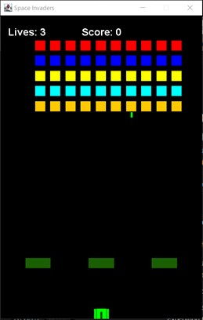
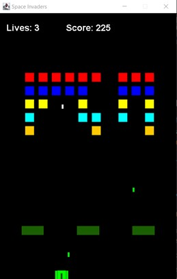
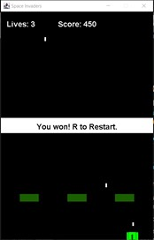
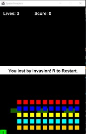
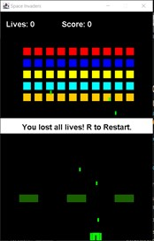

# 1.1 Space Invaders Game Clone Overview

**Overview written by Peter Mitchell.**

## Contents

```
1.1 Space Invaders Game Clone Overview 
1.2 Introduction 
1.3 The Rules of Space Invaders
1.4 High Level Discussion About Implementation 
1.5 How the Core Game Works 
1.6 Features You Could Add
```
# 1.2 Introduction

This document will explain the fundamentals of how the Space Invaders game works. 

- ([Youtube Demo](https://youtu.be/LGGnLAnUXvg))

# 1.3 The Rules of Space Invaders

The rules of Space Invader used for this implementation are as follow:

- The player controls a tank at the bottom of the screen that can move left/right, and fire
    projectiles upward by pressing space.
- Aliens are spawned in a grid; they move slowly down by going left to right with small
    downward motion after each move to the sides. They all move together with uniform
    movement.
- The aliens can fire projectiles at random intervals.
- Projectiles cannot hit the type of object that fired it. For example, player projectiles cannot hit
    the player, and alien projectiles cannot hit any aliens.
- When projectiles hit aliens, both the projectile and alien are destroyed. When projectiles hit
    obstacles, the projectile is destroyed. When projectiles hit the player, the player loses a life.
- The game ends under three conditions. The game is lost if the player runs out of lives, the
    game is also lost if the aliens reach the point where they could touch the player. The game is
    won if all aliens are destroyed.

# 1.4 High Level Discussion About Implementation

Below you can see a couple examples of the game. On the left is the game at the start, and on the
right is an example of part way through clearing out the aliens. The coloured grid near the top are the
aliens. The object at the very bottom is the player. The rectangles slightly above the player are
obstacles. You can see the lives and score at the top of the screen. White projectiles are the players
and green projectiles are the aliens.

 

Below you can see the three game over states. On the left you can see the game won message when
all aliens have been destroyed. In the middle is the game over when the aliens get too far down the
screen. And on the right is an example of the game over when the player runs out of lives.

  

# 1.5 How the Core Game Works

This section will briefly cover the classes used to create the Space Invaders game. For full details about
each class including the behaviours/properties of the classes see the code files where you will find full
comments.

General classes:

- ActionTimer: Used to track time between firing projectiles.
- Position: A position represented with X and Y coordinates.
- Rectangle: Has a position combined with width and height to define an area.

Game specific classes:

- Alien: Defines a single alien that can fire projectiles on random intervals.
- AlienManager: Manages the moving and updating of all the aliens.
- CollidableObject: An interface used to make Alien and Player objects have a hit() action to be
    called when the projectile hits them.
- ObjectManager: Controls the collection of all the player, obstacles, aliens, and projectiles.
- Obstacle: Just a simple obstacle that blocks projectiles.
- Player: The player’s tank that can be moved left/right and fire shots with space.
- Projectile: The object that moves up or down from the Alien or Player that can collide with
    other objects in its path.

Interface classes:

- Game: Creates the JFrame and receives the keyboard input.
- GamePanel: Manages the showing of status text, controls the ObjectManager, game state,
    and keeps the timer going for regular updates on set intervals.

# 1.6 Features You Could Add

The following list of features are some of the possible changes you could make to improve the game.

- Improve the aliens so they look more like aliens instead of just blocks.
- Improve the obstacles by making them destructible. You could do this by making the obstacles
    generate multiple smaller obstacles instead and destroy them when colliding with projectiles.
- Implement multiple waves of enemies. Now you just fight a single wave of enemies. You could
    add multiple waves and even perhaps add additional types of enemies.
- Look at what other Space Invader clones have implemented as features and try to replicate
    those features.
- Come up with your own features to add and implement them.


